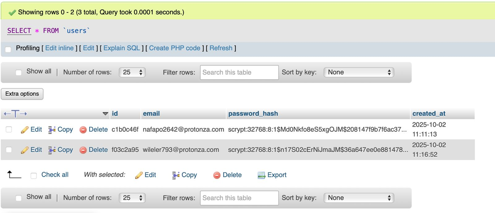

# Python-SMTP-Email-Sender
This project demonstrates sending emails automatically using Python via an SMTP server. SMTP (Simple Mail Transfer Protocol) operates at the application layer. The program connects to Gmail over TCP, starts a secure TLS session, authenticates the sender, and sends a formatted email, illustrating real-time SMTP communication.

# SecureAuth: A Modern Flask Authentication System

<div style="font-family: 'Segoe UI', Tahoma, Geneva, Verdana, sans-serif; padding: 20px; background: linear-gradient(135deg, #667eea 0%, #764ba2 100%); border-radius: 10px; color: white; text-align: center; margin-bottom: 30px;">
    <h1 style="margin: 0; font-size: 2.5em; font-weight: 700;">🚀 SecureAuth</h1>
    <p style="margin: 10px 0 0 0; font-size: 1.2em; opacity: 0.9;">A professional, tab-based user registration and password reset system built with Flask.</p>
</div>

<div style="font-family: 'Segoe UI', Tahoma, Geneva, Verdana, sans-serif; line-height: 1.6;">

## 🌟 Features

This project showcases a modern and secure authentication workflow with a focus on user experience and professional design.

- **✨ Modern UI/UX**: Clean, responsive, and animated interface built with Bootstrap 5.
- **🔄 Tab-Based Navigation**: Seamlessly switch between "Register" and "Forgot Password" forms on a single page.
- **📧 Beautiful HTML Emails**: Sends professionally designed HTML emails for registration and password resets.
- **🔒 Secure**: Passwords are hashed using `werkzeug.security`. Credentials are generated securely.
- **⚡ Real-Time Validation**: Client-side email validation provides instant feedback to the user.
- **🗄️ MySQL Integration**: Uses `mysql-connector-python` for robust database management.
- **📬 SMTP Email Sending**: Uses Gmail SMTP to send account credentials and password resets.

---

## 🛠️ Setup & Installation

### 1. Prerequisites

- Python 3.7+
- MySQL Server
- Gmail Account (for SMTP)

### 2. Clone the Repository

```bash
git clone https://github.com/YASHNACHUGH2408/Python-SMTP-Email-Sender.git
cd Python-SMTP-Email-Sender
````

### 3. Install Python Dependencies

It is recommended to use a virtual environment:

```bash
# Create virtual environment
python -m venv venv

# Activate it
# Windows:
venv\Scripts\activate
# macOS/Linux:
source venv/bin/activate

# Install dependencies
pip install Flask mysql-connector-python werkzeug
```

### 4. Database Setup

Start MySQL server and create the database and table:

```sql
CREATE DATABASE userdb;

USE userdb;

CREATE TABLE users (
    id VARCHAR(255) PRIMARY KEY,
    email VARCHAR(255) UNIQUE NOT NULL,
    password_hash VARCHAR(255) NOT NULL,
    created_at TIMESTAMP DEFAULT CURRENT_TIMESTAMP
);
```

### 5. Configure the Application

Open `app.py` and update the following:

**Database Config:**

```python
DB_CONFIG = {
    'host': 'localhost',
    'user': 'your_mysql_user',        # e.g., 'root'
    'password': 'your_mysql_password',
    'database': 'userdb'
}
```

**SMTP (Email) Config:**

```python
SMTP_USER = "your_email@gmail.com"
SMTP_PASS = "your_gmail_app_password" # Use an App Password for Gmail
```

> **Note:** This project uses Gmail SMTP to send emails. You need a Gmail account with an App Password enabled (if 2FA is on).

### 6. Run the Application

```bash
python app.py
```

The application will be available at: [http://127.0.0.1:5000](http://127.0.0.1:5000)

## 🖼️ Screenshots

To give a visual overview of the project, here are some key screenshots:

---

### 1. Registration Page
  
This is the main registration interface where new users can sign up. The form includes real-time email validation and a modern, tab-based UI built with Bootstrap 5.

---

### 2. Forgot Password Page
  
This page allows users to reset their password. Once the email is submitted, a new password is generated and sent securely via Gmail SMTP.

---

### 3. Code (app.py)
  
A snapshot of the main Python file (`app.py`) showing Flask routes, SMTP email handling, database interactions, and password hashing.

---

### 4. Database Structure
  
This shows the `users` table in MySQL, including columns for `id`, `email`, `password_hash`, and `created_at`. The database stores user credentials securely.


---

### 5. Sample Email
 

  
An example of the HTML email sent to users after registration or password reset. Includes user ID, password, and a professional design for readability and branding.
